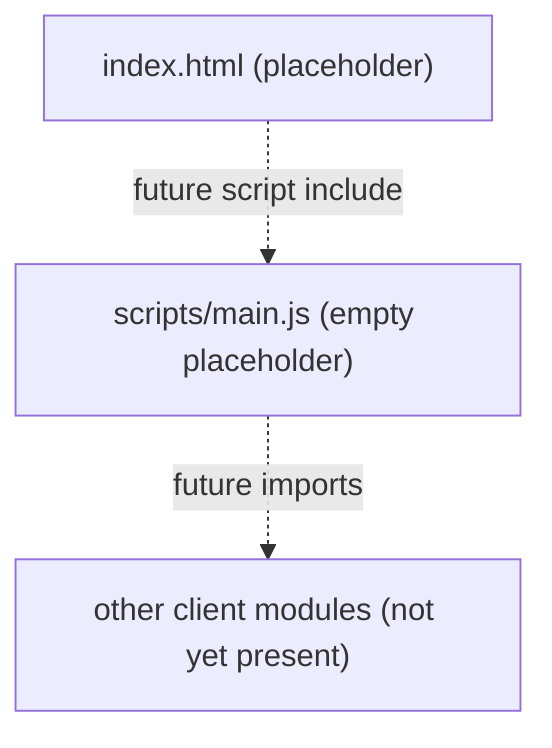

# client/scripts/main.js

Empty placeholder for the client-side entry-point script; currently contains no code.

## Purpose and scope

`src/client/scripts/main.js` is the intended browser entry point for the client
application. As of this writing the file is a 0-byte placeholder — it defines no
functions, classes, constants, or imports and produces no behavior. It exists to
reserve the conventional entry-point location alongside the other client
scaffolding (`src/client/index.html`, `src/client/styles/styles.css`, and the
`src/client/assets/` directory), all of which are likewise empty placeholders in
this template repository.

This document mirrors the file in its current empty state. When real logic is
added to `main.js`, this document must be updated in the same change to describe
the actual entry points, contracts, data flow, and tests.

## Key entry points and contracts

None. The file is empty, so it exports nothing and exposes no public functions,
classes, or constants. It is not currently referenced by any loaded HTML
(`src/client/index.html` is also an empty placeholder and contains no `<script>`
tag pointing at this file).

## Architecture / data flow

There is no runtime behavior to diagram. The diagram below shows only the
intended placement of the file within the client scaffolding.

## Dependencies and side effects

- Dependencies: none. The file imports nothing.
- Side effects: none. Nothing is executed, registered, or mutated because the
  file is empty.
- Build/package context: `src/client/package.json` does not yet exist, so there
  is no npm toolchain, bundler, or module system wired up for the client. Per the
  repository's security configuration, frontend (npm) gates activate
  automatically once `src/client/package.json` is added.

## Error handling behavior

None. With no code, there are no error paths, exceptions, or logging.

## Test coverage mapping and execution commands

There are no dedicated tests for this module because it contains no code to
test. No test files under `tests/` reference `src/client/scripts/main.js`.

The repository test runner is `./scripts/test-suite.sh`; run it before commits.
When functional logic is added to `main.js`, add corresponding tests (the
template targets 100% unit test coverage of public functions) and update this
section to map each public entry point to its covering test.

## Known assumptions and limitations

- The file is an intentional placeholder; it has no functionality yet.
- It is not currently included by any HTML page, so even if populated it would
  not load until `src/client/index.html` (or another loader) references it.
- No client build system or `package.json` exists yet, so module syntax
  (ES modules vs. classic script) and any bundling expectations are undecided.
- This document describes the empty state only and will become stale as soon as
  code is added; treat any future divergence between this doc and the source as a
  signal to update the doc.
