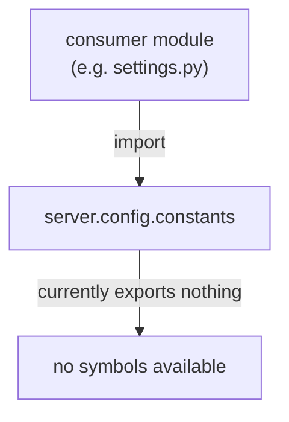

# server/config/constants.py

Placeholder module intended to hold shared constants for the server configuration and runtime; it currently defines no constants.

## Purpose and scope

`src/server/config/constants.py` is a skeleton module reserved for values that are shared across the server configuration and runtime (for example, default ports, environment names, or sentinel values referenced by `src/server/config/settings.py`). As of this writing the file contains only a module docstring and declares nothing else.

## Key entry points and contracts

None. The module exposes no public functions, classes, or constants — the file body is a single module docstring (`"""Shared constants for the server configuration and runtime."""`). Importing the module succeeds and binds the package namespace but provides no symbols to consume.

## Architecture / data flow

## Dependencies and side effects

No imports. No module-level statements other than the docstring, so importing the module has no side effects (no I/O, no environment reads, no network or filesystem access).

## Error handling behavior

None. There is no executable code, so the module raises nothing on import and has no error paths. Attempting to reference a constant from this module would raise the usual `ImportError` / `AttributeError` from Python, since none are defined.

## Test coverage mapping and execution commands

There are no dedicated tests for this module, and none are needed while it has no public surface (no exported functions, methods, or constants to cover). Add tests under `tests/` once concrete constants or logic are introduced. Run the project suite with `./scripts/test-suite.sh`.

## Known assumptions and limitations

- The module is a placeholder/skeleton; the docstring describes intended scope, not implemented behavior.
- Consumers should not import names from this module until constants are actually defined here.
- When constants are added, they should be the single source of truth for the values they represent and this document should be updated to list them with their contracts.
