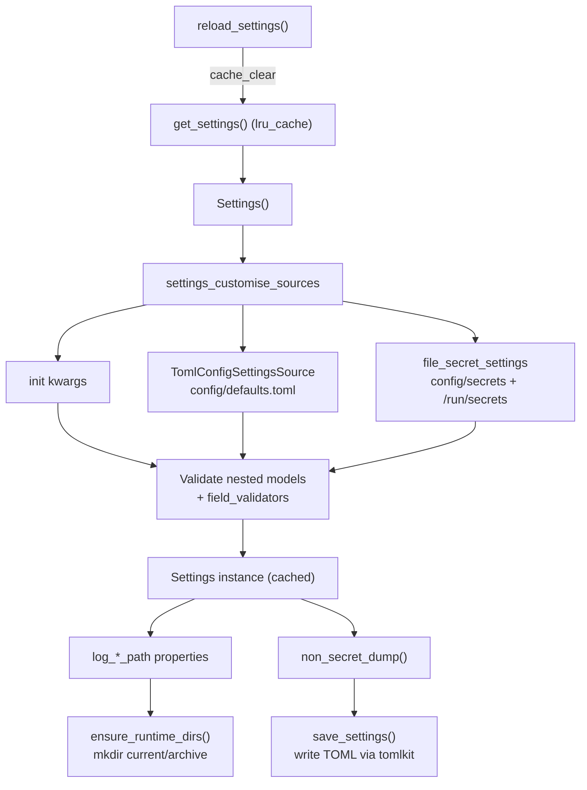

# server/config/settings.py

Typed application configuration loaded from a TOML file plus mounted secret files, exposed as a cached process-wide `Settings` singleton.

## Purpose and scope

`src/server/config/settings.py` defines the application's configuration schema and loading strategy. Non-secret values are read from `config/defaults.toml`; secret values are read from per-field files under `config/secrets` (dev) and `/run/secrets` (container). The module validates and structures these into nested Pydantic models, provides a cached accessor for FastAPI/runtime use, and offers helpers to create runtime directories and to write non-secret config back to TOML. Environment variables and `.env` files are deliberately excluded as sources.

## Key entry points and contracts

- `Settings` (class, `pydantic_settings.BaseSettings`): top-level config model. Holds nested sections `app`, `server`, `workers`, `logging`, `observability`, `features`, `metrics`, `tracing`, plus optional top-level secrets (`openai_api_key`, `anthropic_api_key`, `jwt_signing_key`, `postgres_password`, `redis_password`) typed as `SecretStr | None`. Accepts init kwargs (used by tests). `extra` keys are ignored; defaults are validated.
- `Settings.settings_customise_sources(...)` (classmethod, overrides Pydantic hook): returns the source precedence tuple `(init_settings, TomlConfigSettingsSource, file_secret_settings)`. Highest priority is init kwargs, then the TOML file, then secret files. No env/dotenv sources.
- `Settings.non_secret_dump() -> dict[str, dict[str, object]]`: returns `model_dump` with all five secret fields excluded; the writable, non-secret view of config.
- `Settings.log_root_path -> Path` (property): absolute resolved path of `REPO_ROOT / logging.root`.
- `Settings.log_current_path -> Path` (property): absolute resolved path of the active JSONL log directory (`logging.current_dir`).
- `Settings.log_archive_path -> Path` (property): absolute resolved path of rotated log archives (`logging.archive_dir`).
- `get_settings() -> Settings` (`@lru_cache(maxsize=1)`): returns the process-wide cached `Settings` instance, constructing it on first call.
- `reload_settings() -> Settings`: clears the `get_settings` cache and returns a freshly loaded instance.
- `ensure_runtime_dirs(settings: Settings | None = None) -> None`: creates `log_current_path` and `log_archive_path` (with parents, idempotent). Uses the passed settings or falls back to `get_settings()`.
- `save_settings(settings: Settings, path: Path = APP_CONFIG_PATH) -> None`: writes the non-secret dump back to the TOML file using TOML Kit (preserving existing formatting/comments where possible); ensures the parent directory exists; never writes secrets.

Nested config models, each a `pydantic.BaseModel` with typed defaults:

- `AppConfig` — `name`, `env`, `debug`.
- `ServerConfig` — `host`, `port`.
- `WorkersConfig` — `max_processes`, `spawn_mode`, `request_timeout_ms`.
- `LoggingConfig` — `root`, `current_dir`, `archive_dir`, `level`, `format`, `max_mb`, `backup_count`. Validators: `level` is upper-cased and must be one of DEBUG/INFO/WARNING/ERROR/CRITICAL; `format` is lower-cased and must be `jsonl`.
- `ObservabilityConfig` — `service_name`, `metrics_enabled`, `tracing_enabled`, `log_correlation_enabled`, `otlp_endpoint`, `sample_ratio`. Validator: `sample_ratio` must be in `[0.0, 1.0]`.
- `FeaturesConfig` — `web_ui_writes_config`.
- `MetricsConfig` — `path`, `namespace`, `subsystem`, `process_metrics_enabled`.
- `TracingConfig` — `exporter`, `protocol`, `insecure`, `timeout_ms`.

Module-level path constants: `REPO_ROOT` (three parents up from this file), `CONFIG_DIR` (`<repo>/config`), `APP_CONFIG_PATH` (`<config>/defaults.toml`), `LOCAL_SECRETS_DIR` (`<config>/secrets`), `RUNTIME_SECRETS_DIR` (`/run/secrets`).

## Architecture / data flow

## Dependencies and side effects

- External libraries: `pydantic` (`BaseModel`, `SecretStr`, `field_validator`), `pydantic_settings` (`BaseSettings`, `PydanticBaseSettingsSource`, `SettingsConfigDict`, `TomlConfigSettingsSource`), and `tomlkit` (`document`, `dumps`, `parse`, `table`). Standard library: `functools.lru_cache`, `pathlib.Path`, `typing`.
- Side effects on import: none beyond computing path constants (no filesystem reads/writes at import time).
- Side effects at runtime:
  - `get_settings()` reads `config/defaults.toml` and any present secret files on first call; results are cached for the process lifetime.
  - `ensure_runtime_dirs()` creates the log `current` and `archive` directories on disk.
  - `save_settings()` reads the existing TOML (if present) and writes the file, replacing each top-level non-secret section with current validated values.
- The `Settings.model_config` sets `secrets_dir_missing="ok"`, so missing secret directories do not raise.

## Error handling behavior

- The module performs no explicit `try/except`; errors surface as exceptions from Pydantic and the filesystem.
- Validation errors: invalid `logging.level` (not in the allowed set) and invalid `logging.format` (not `jsonl`) raise `ValueError` inside their validators; `observability.sample_ratio` outside `[0.0, 1.0]` likewise raises `ValueError`. These are wrapped into a Pydantic `ValidationError` during `Settings` construction (i.e., on first `get_settings()` / `reload_settings()`).
- Type coercion failures for any field also raise `ValidationError`.
- Missing secret files/directories are tolerated (`secrets_dir_missing="ok"`); the corresponding secret fields default to `None`.
- `save_settings()` and `ensure_runtime_dirs()` create parent directories as needed; underlying `OSError`/`PermissionError` from `mkdir`/`write_text` propagate to the caller unhandled.

## Test coverage mapping and execution commands

- No dedicated unit test module targets `settings.py`. The only direct coverage is the e2e smoke test `tests/e2e/test_smoke.py::test_settings_loads`, which calls `get_settings()` and asserts `settings.app.name` is truthy and `settings.server.port > 0`. This exercises the cached singleton, TOML loading, and nested-model construction, but does not cover the validators (`LoggingConfig.normalize_level` / `validate_format`, `ObservabilityConfig.validate_sample_ratio`), `non_secret_dump`, the `log_*_path` properties, `reload_settings`, `ensure_runtime_dirs`, or `save_settings`.
- Run the project test suite with `./scripts/test-suite.sh`. To target the smoke test directly: `pytest tests/e2e/test_smoke.py`.
- To reach the repo's 100% public-function coverage bar, add a dedicated `tests/unit/` module covering the validators (valid + invalid inputs), `non_secret_dump` secret exclusion, the log-path properties, `reload_settings` cache behavior, `ensure_runtime_dirs` directory creation, and `save_settings` TOML write-back.

## Known assumptions and limitations

- Path resolution assumes this file lives at `src/server/config/settings.py`; `REPO_ROOT = Path(__file__).resolve().parents[3]`. Moving the file changes `REPO_ROOT` and all derived paths.
- Environment variables and `.env` files are intentionally not consulted; configuration comes only from init kwargs, the TOML file, and secret files.
- `get_settings()` caches a single instance for the process; configuration changes on disk are not picked up until `reload_settings()` is called.
- `save_settings()` writes only the sections present in `non_secret_dump()`; secret fields are never persisted. It rewrites each top-level section wholesale, so non-section top-level keys in an existing TOML are left untouched but section-level comments/ordering inside replaced tables may not be fully preserved.
- `RUNTIME_SECRETS_DIR` is hardcoded to `/run/secrets`, matching Docker/Compose secret mounts.
- The `model_config` and `settings_customise_sources` carry `pyright` ignore directives because the pydantic-settings stubs do not match runtime kwargs; the values are valid at runtime.
