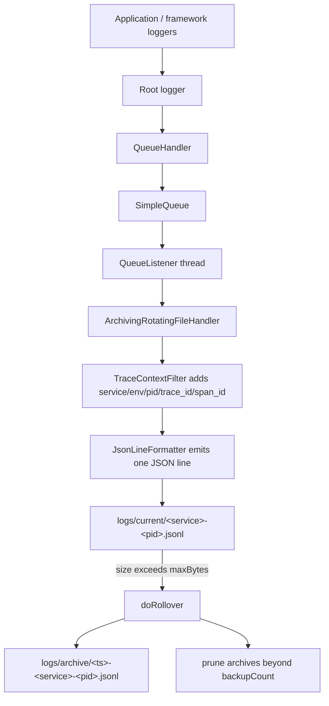

# server/logging/logging.py

Process-local logging that writes one JSON object per line to a rotating, archiving JSONL file, enriched with service metadata and OpenTelemetry trace/span IDs.

## Purpose and scope

This module configures the application's logging pipeline for a single process (e.g. a FastAPI lifespan startup or a worker entry point). It:

- Formats every log record as a single-line JSON object (`JsonLineFormatter`) suitable for `jq`, Loki, or Grafana Alloy tails.
- Enriches records with service name, environment, PID, process name, and OpenTelemetry trace/span IDs (`TraceContextFilter`).
- Routes records through a non-blocking queue (`QueueHandler`/`QueueListener`) to a size-based rotating file handler that moves rolled files into an archive directory (`ArchivingRotatingFileHandler`).

Scope is limited to wiring up the stdlib `logging` system and the JSONL file sink. It does not export logs to remote backends directly; remote shipping is expected to tail the JSONL files. Settings are sourced from `src/server/config` (`Settings`, `get_settings`, `ensure_runtime_dirs`).

## Key entry points and contracts

Public API (intended for external callers):

- `configure_logging(settings: Settings | None = None) -> None` — Configures process-local logging exactly once. Resolves settings via `get_settings()` when `settings` is `None`, ensures runtime directories exist, builds the formatter/filter/handlers, replaces root logger handlers with a `QueueHandler`, starts the `QueueListener`, redirects framework loggers (`uvicorn`, `uvicorn.error`, `uvicorn.access`, `fastapi`) to propagate to root, and enables `logging.captureWarnings(True)`. Idempotent: returns immediately if already configured. Raises `ValueError` (via `_coerce_level`) if the configured logging level name is invalid.
- `shutdown_logging() -> None` — Stops the `QueueListener` and closes the file handler, resetting module globals so logging can be reconfigured. Safe to call when logging was never configured (no-op on `None` globals). Registered with `atexit` to run at interpreter exit.
- `reconfigure_logging(settings: Settings | None = None) -> None` — Convenience wrapper that calls `shutdown_logging()` then `configure_logging(settings=settings)`, allowing handlers to be rebuilt with new settings.
- `get_logger(name: str | None = None) -> logging.Logger` — Returns `logging.getLogger(name)` when `name` is truthy, otherwise the default application logger named `"yourapp"`.

Public classes (used internally by `configure_logging` but importable):

- `TraceContextFilter(logging.Filter)` — Constructed from `Settings`; its `filter(record)` attaches `service`, `environment`, `pid`, `process_name`, `trace_id`, and `span_id` to the record and always returns `True`. Trace/span IDs are populated from the current OpenTelemetry span when available and valid, otherwise left as `None`.
- `JsonLineFormatter(logging.Formatter)` — `format(record)` returns a single compact JSON line containing timestamp, level, logger, message, correlation fields, source location, plus an `exception`/`stack` field when present and an `extra` object for any non-reserved custom record attributes.
- `ArchivingRotatingFileHandler(RotatingFileHandler)` — Keyword-only constructor taking `archive_dir`, `service_name`, `filename`, and standard rotation options (`maxBytes`, `backupCount`, `encoding`, `delay`). On rollover it moves the hot file into `archive_dir` under a UTC-timestamped, PID-tagged name and prunes archives beyond `backupCount` for that PID.

Module-level helpers prefixed with `_` (`_utc_now_iso`, `_json_default`, `_coerce_level`, `_current_file_path`) and the globals (`_logging_configured`, `_log_queue`, `_queue_listener`, `_file_handler`, `_RESERVED_RECORD_KEYS`) are private implementation details.

## Architecture / data flow



## Dependencies and side effects

Dependencies:

- Standard library: `atexit`, `json`, `logging`, `os`, `queue`, `datetime`, `logging.handlers` (`QueueHandler`, `QueueListener`, `RotatingFileHandler`), `pathlib`, `typing`.
- Internal: `server.config` (`Settings`, `ensure_runtime_dirs`, `get_settings`).
- Optional runtime: `opentelemetry` — imported lazily inside `TraceContextFilter.filter`; absence (or any failure) is tolerated and simply leaves trace/span IDs unset.

Side effects:

- Mutates global logging state: clears and replaces the root logger's handlers, sets the root level, clears handlers on framework loggers and sets them to propagate, and enables warning capture.
- Starts a background `QueueListener` thread.
- Creates runtime directories (via `ensure_runtime_dirs`) and the archive directory; opens and writes the JSONL log file under `settings.log_current_path`; writes/renames/deletes files under `settings.log_archive_path` during rotation and pruning.
- Maintains module-level globals tracking configured state and live handler/queue/listener objects.
- Registers `shutdown_logging` with `atexit` at import time.

## Error handling behavior

- Invalid logging level names raise `ValueError` from `_coerce_level` during `configure_logging`.
- `TraceContextFilter.filter` wraps all OpenTelemetry access in a broad `except Exception` so logging never fails when telemetry is missing or misbehaving; trace/span IDs fall back to `None`.
- `JsonLineFormatter` uses a `_json_default` serializer fallback so non-JSON-native values (`Path`, `set`/`frozenset`, arbitrary objects) are coerced rather than raising during `json.dumps`.
- `ArchivingRotatingFileHandler._prune_archives` ignores `FileNotFoundError` when unlinking already-removed archive files.
- `configure_logging` is guarded by `_logging_configured` to avoid double-configuration; `shutdown_logging` guards against `None` globals so it is safe to call unconditionally.

## Test coverage mapping and execution commands

There are currently no dedicated unit tests for this module under `tests/` (the only present test files are `tests/unit/test_check_memory_reasoning.py` and `tests/e2e/test_smoke.py`). Per the project's 100% public-function coverage requirement, tests should be added under `tests/unit/` covering: idempotent `configure_logging`, `shutdown_logging`/`reconfigure_logging` lifecycle, `get_logger` naming, `JsonLineFormatter` output (including `exception`, `stack`, and `extra` fields), `TraceContextFilter` field injection with and without OpenTelemetry, and `ArchivingRotatingFileHandler` rollover/prune behavior.

Run the project test suite (which also enforces coverage and gates) with:

```
./scripts/test-suite.sh
```

## Known assumptions and limitations

- Logging is process-local: each process writes to `logs/current/<service>-<pid>.jsonl`, identified by PID. There is no shared cross-process file or central aggregation in this module.
- Configuration is effectively a singleton via module globals; only one active logging configuration exists per process, and `configure_logging` is a no-op after the first successful call until `shutdown_logging`/`reconfigure_logging` resets it.
- The default application logger name is hardcoded to `"yourapp"` and should be customized for a real project.
- Rotation is size-based (`maxBytes`); there is no time-based rotation. Archive pruning is per-PID, so total archive size across many short-lived PIDs is not bounded by `backupCount` alone.
- Trace correlation depends on an active, valid OpenTelemetry span in the current context; without it, `trace_id`/`span_id` remain `None`.
- The `QueueListener` runs on a background thread; records enqueued very close to interpreter shutdown rely on the `atexit`-registered `shutdown_logging` to flush, and abrupt termination may drop in-flight records.
