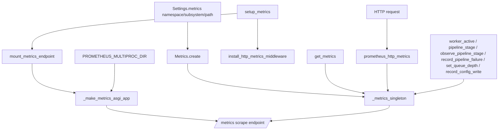

# server/logging/metrics.py

Prometheus instrument definitions, a FastAPI scrape endpoint and HTTP middleware, plus context managers and helpers for instrumenting worker and pipeline activity.

## Purpose and scope

`src/server/logging/metrics.py` centralizes Prometheus metric instruments for the API and background workers. It defines the metric bundle, builds the `/metrics` ASGI scrape app (with multiprocess support), installs request-timing middleware, and exposes small helpers/context managers for recording pipeline, worker, queue, and config-write activity. Metric names are namespaced/subsystem-prefixed from `Settings.metrics` (`MetricsConfig` in `src/server/config/settings.py`).

## Key entry points and contracts

- `Metrics` (dataclass, `slots=True`) — Bundle of Prometheus instruments: `http_requests_total` (Counter), `http_request_duration_seconds` (Histogram), `http_requests_in_progress` (Gauge), `worker_processes_active` (Gauge), `pipeline_stage_total` (Counter), `pipeline_stage_duration_seconds` (Histogram), `pipeline_stage_failures_total` (Counter), `pipeline_queue_depth` (Gauge), `config_write_total` (Counter).
- `Metrics.create(settings: Settings) -> Metrics` — Classmethod that constructs all instruments using `settings.metrics.namespace` and `settings.metrics.subsystem`; registers them on the prometheus_client default registry. Returns the populated `Metrics` bundle. Calling twice in one process raises a duplicate-timeseries error from prometheus_client.
- `get_metrics(settings: Settings | None = None) -> Metrics` — Returns the lazily created process-wide singleton, building it from the supplied `settings` (or `get_settings()`) on first call. Returns the same instance thereafter.
- `reset_metrics_for_tests() -> None` — Clears the module-level singleton so a fresh interpreter/test can rebuild it. Does not unregister already-created prometheus collectors.
- `mount_metrics_endpoint(app: FastAPI, settings: Settings | None = None) -> None` — Mounts the Prometheus scrape ASGI app at `settings.metrics.path` (default `/metrics`) on `app`. No return.
- `install_http_metrics_middleware(app: FastAPI, settings: Settings | None = None) -> None` — Registers an HTTP middleware that records request count, latency, and in-flight gauge. Idempotent: a second call is a no-op once `app.state._http_metrics_installed` is set. No return.
- `setup_metrics(app: FastAPI, settings: Settings | None = None) -> None` — Convenience wrapper that calls `mount_metrics_endpoint` then `install_http_metrics_middleware`. No return.
- `worker_active(worker_type: str = "pipeline")` — Context manager that increments `worker_processes_active` for the block and decrements it in `finally` (even on exception).
- `pipeline_stage(stage: str)` — Context manager that times a pipeline stage; on exception it increments `pipeline_stage_failures_total` (labeled by exception class name) and re-raises; always records `pipeline_stage_total` and `pipeline_stage_duration_seconds` with status `ok`/`error`.
- `observe_pipeline_stage(stage: str, duration_seconds: float, status: str = "ok") -> None` — Records stage total and duration when timing is measured manually. No return.
- `record_pipeline_failure(stage: str, error_type: str) -> None` — Increments the labeled failure counter for a stage/error type. No return.
- `set_queue_depth(queue_name: str, depth: int) -> None` — Sets the labeled `pipeline_queue_depth` gauge for backpressure visibility. No return.
- `record_config_write(success: bool) -> None` — Increments `config_write_total` with result label `ok` or `error`. No return.

Module-private helpers (not part of the public surface): `_is_multiprocess_enabled`, `_route_template`, `_make_metrics_asgi_app`.

## Architecture / data flow

## Dependencies and side effects

- Third-party: `fastapi` (`FastAPI`, `Request`, `Response`), `prometheus_client` (`CollectorRegistry`, `Counter`, `Gauge`, `Histogram`, `make_asgi_app`, `multiprocess`).
- Stdlib: `os`, `time`, `contextlib.contextmanager`, `dataclasses.dataclass`, `collections.abc.Awaitable`/`Callable`.
- Internal: `server.config` (`Settings`, `get_settings`).
- Side effects: `Metrics.create` registers collectors on prometheus_client's global default registry. `get_metrics` mutates module-level `_metrics_singleton`. `mount_metrics_endpoint` and `install_http_metrics_middleware` mutate the FastAPI app (route mount, middleware registration, `app.state._http_metrics_installed` flag). `_make_metrics_asgi_app` reads the `PROMETHEUS_MULTIPROC_DIR` environment variable and, when set, builds a fresh `CollectorRegistry` with a `MultiProcessCollector`. The middleware mutates gauge/counter/histogram values per request.

## Error handling behavior

- The HTTP middleware (`prometheus_http_metrics`) uses try/except/finally: it defaults `status_code` to `500`, lets any downstream exception propagate (re-raised after the `except`), and always records request count, duration, and decrements the in-flight gauge in the `finally` block so metrics stay consistent even on failure.
- `pipeline_stage` catches exceptions to set status `error`, increments the failure counter (labeled with `type(exc).__name__`), then re-raises; the `finally` block always records the stage total and duration.
- `worker_active` decrements the active-worker gauge in `finally`, so the gauge is balanced even if the wrapped block raises.
- This module does not swallow exceptions or perform its own logging. Re-invoking `Metrics.create` in the same process surfaces prometheus_client's duplicate-registration error; `reset_metrics_for_tests` only clears the singleton reference and does not unregister collectors, so reuse generally requires a fresh interpreter.

## Test coverage mapping and execution commands

There are currently no dedicated tests for this module — a search of `tests/` for `metric` returned no matches, and no `tests/.../test_metrics*.py` exists. Run the project test suite with `./scripts/test-suite.sh` (from the repo root). When adding tests, prefer the documented pattern: call `reset_metrics_for_tests()` and exercise the module in a fresh interpreter (or subprocess) to avoid prometheus_client duplicate-timeseries errors across test cases.

## Known assumptions and limitations

- Assumes `Settings` exposes a `metrics` attribute of type `MetricsConfig` with `path`, `namespace`, `subsystem`, and `process_metrics_enabled` fields (matches `MetricsConfig` in `src/server/config/settings.py`).
- Metrics use a process-wide singleton plus the prometheus_client default registry, so instruments can only be created once per process; this conflicts with repeated `Metrics.create` calls and complicates per-test isolation.
- `process_metrics_enabled` from config is not consumed in this file; process/platform collectors are not explicitly toggled here.
- Multiprocess mode is selected solely by the presence of the `PROMETHEUS_MULTIPROC_DIR` environment variable; per-collector `multiprocess_mode` settings (`livesum`, `livemostrecent`) only take effect under that mode.
- The `path` label in HTTP metrics uses the FastAPI route template when available (falling back to the raw request path), which bounds label cardinality but exposes the literal path for unmatched routes.
- Histogram buckets for HTTP and pipeline latencies are hard-coded and tuned for sub-second to low-seconds workloads.
