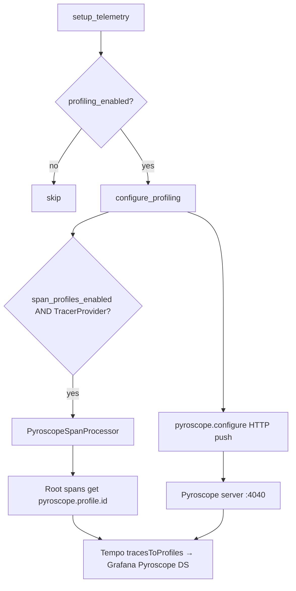

# server/logging/profiling.py

Grafana Pyroscope continuous profiling bootstrap, process labels, optional OpenTelemetry span-profile bridge, and a small tag context manager.

## Purpose and scope

`src/server/logging/profiling.py` is the **profiles** pillar of the observability stack (alongside logs, metrics, and traces). It starts the Pyroscope Python agent (`pyroscope-io`) once per process, labels profiles with service/environment/process role, and optionally registers `pyroscope-otel`'s `PyroscopeSpanProcessor` on the global OpenTelemetry `TracerProvider` so Grafana Tempo can deep-link spans to flamegraphs.

It does not ship profiles through Alloy/OTLP in this template: the SDK pushes HTTP profiles directly to `profiling.server_address` (default `http://pyroscope:4040`). Gating is owned by `setup_telemetry` via `observability.profiling_enabled` (default **false**).

## Key entry points and contracts

- `configure_profiling(settings=None, *, process_role="api", extra_tags=None) -> None` — Idempotent process initializer. Calls `pyroscope.configure` with `application_name` from `observability.service_name`, client options from `settings.profiling`, and tags `{service_name, environment, process_role}` plus any `extra_tags`. When `profiling.span_profiles_enabled` is true and the global tracer provider is a real SDK `TracerProvider`, installs `PyroscopeSpanProcessor` once.
- `shutdown_profiling() -> None` — Calls `pyroscope.shutdown()` when configured; clears module flags. Registered with `atexit`. Safe no-op when never configured.
- `is_profiling_configured() -> bool` — Whether `configure_profiling` has completed successfully in this process.
- `reset_profiling_for_tests() -> None` — Clears module flags without calling the native agent (tests only).
- `profile_tags(tags)` — Context manager wrapping `pyroscope.tag_wrapper` for temporary labels (e.g. pipeline stage).
- `_register_span_profiles()` (private) — Attaches the span processor when possible; no-op on non-SDK providers.

## Architecture / data flow

**Correlation model (with the rest of the stack):**

| Signal | Path |
|--------|------|
| Logs | JSONL → Alloy → Loki |
| Metrics | `/metrics` scrape → Prometheus |
| Traces | OTLP → Alloy → Tempo |
| Profiles | App SDK → Pyroscope; Tempo → Pyroscope via `tracesToProfiles` |

## Dependencies and side effects

- Third party: `pyroscope-io` (`pyroscope.configure` / `shutdown` / `tag_wrapper`), `pyroscope-otel` (`PyroscopeSpanProcessor`), OpenTelemetry API/SDK (`trace.get_tracer_provider`, `TracerProvider`).
- Internal: `server.config.Settings` / `get_settings` (`observability`, `profiling`, `app.env`).
- Side effects: starts a native sampling agent; opens HTTP client to Pyroscope; may mutate the global `TracerProvider` by adding a span processor; registers `atexit` shutdown.

## Error handling behavior

- Idempotent: second `configure_profiling` returns immediately.
- If span profiles are requested but tracing was not configured (proxy/no-op provider), the agent still starts and the bridge is skipped without raising.
- SDK / network failures from `pyroscope.configure` propagate to the caller; `_profiling_configured` is set only after a successful `configure` call.
- `shutdown_profiling` is null-safe when profiling was never started.

## Test coverage mapping and execution commands

- `tests/unit/test_profiling.py` — configure kwargs/tags, idempotency, span processor registration, skip bridge when disabled, shutdown no-op/call, `profile_tags`, telemetry order and feature flag, `ProfilingConfig` validators.
- Run: `pytest tests/unit/test_profiling.py` or `./scripts/test-suite.sh`.

## Known assumptions and limitations

- **Off by default** in the template so clones that do not run Pyroscope pay no overhead.
- Each process (API and each worker) needs its own `configure_profiling` call when enabled.
- Span profiles currently support CPU only (upstream Pyroscope limitation); short spans may miss samples.
- Span processors cannot be removed from `TracerProvider` on shutdown; flags only prevent double-registration within one process lifetime.
- macOS SIP can interfere with native profilers when using system Python; prefer a user-installed interpreter (e.g. pyenv) for local profiling.
