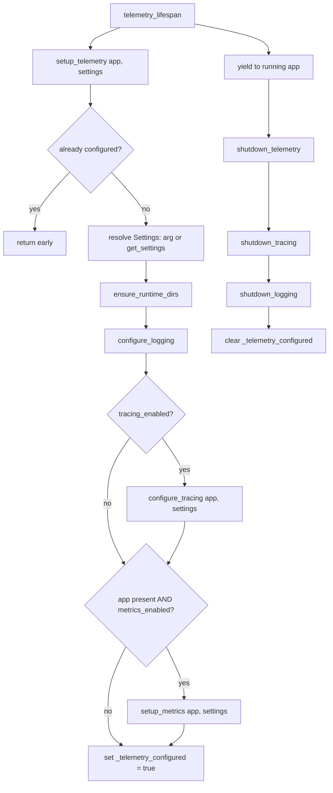

# server/logging/telemetry.py

Process-wide telemetry facade that wires logging, distributed tracing, and metrics together behind a single setup/shutdown entrypoint and a FastAPI lifespan helper.

## Purpose and scope

This module is the single coordination point for observability initialization in `src/server/logging/telemetry.py`. It does not implement logging, tracing, or metrics itself; it orchestrates the sibling modules (`src/server/logging/logging.py`, `src/server/logging/tracing.py`, `src/server/logging/metrics.py`) in the correct order, gated by settings flags, and guarded against double-initialization. It is intended to be called once per process: in the API process (with a `FastAPI` app, enabling FastAPI metrics) and in workers (without an app, getting logging and tracing only).

## Key entry points and contracts

- `setup_telemetry(app=None, settings=None) -> None` — Idempotent process initializer. Resolves settings via the passed `settings` or `get_settings()`, calls `ensure_runtime_dirs`, then `configure_logging`. Configures tracing only when `settings.observability.tracing_enabled` is true (passing `app` for FastAPI instrumentation when present). Sets up metrics only when an `app` is provided and `settings.observability.metrics_enabled` is true. Returns immediately with no effect if telemetry was already configured in this process. Returns `None`.
- `shutdown_telemetry() -> None` — Tears down telemetry for the process by calling `shutdown_tracing()` then `shutdown_logging()`, and clears the configured flag so a later `setup_telemetry` can run again. Note: it does not tear down metrics. Returns `None`.
- `telemetry_lifespan(app) -> AsyncIterator[None]` — Async context manager (FastAPI `lifespan`). On entry calls `setup_telemetry(app=app)`; yields once during the running app; on exit always calls `shutdown_telemetry()` in a `finally` block. Intended for `FastAPI(lifespan=telemetry_lifespan)`.
- `_telemetry_configured` (module-level bool) — Internal idempotency flag (not part of the public API). It is read and mutated by `setup_telemetry` and `shutdown_telemetry`.

## Architecture / data flow

## Dependencies and side effects

Standard library: `collections.abc.AsyncIterator`, `contextlib.asynccontextmanager`. Third party: `fastapi.FastAPI` (type/parameter only). Internal: `server.config` (`Settings`, `ensure_runtime_dirs`, `get_settings`) and the sibling modules `logging.py` (`configure_logging`, `shutdown_logging`), `metrics.py` (`setup_metrics`), and `tracing.py` (`configure_tracing`, `shutdown_tracing`).

Side effects are delegated but real: `ensure_runtime_dirs` creates runtime directories on disk; `configure_logging` reconfigures the root logging system and may open log files; `configure_tracing` installs an OpenTelemetry tracer/exporter and may instrument the FastAPI app; `setup_metrics` mounts metrics endpoints and middleware onto the FastAPI app. The module also mutates the process-global `_telemetry_configured` flag.

## Error handling behavior

This module performs no error handling of its own; it has no try/except and raises nothing directly. Exceptions raised by `get_settings`, `ensure_runtime_dirs`, `configure_logging`, `configure_tracing`, or `setup_metrics` propagate to the caller, and on such a failure `_telemetry_configured` is left `False` (the flag is set only after all enabled steps succeed), so a subsequent `setup_telemetry` call will retry from the top. The only control-flow guard is the idempotency early-return when `_telemetry_configured` is already `True`. `telemetry_lifespan` guarantees `shutdown_telemetry()` runs via a `finally` block even if the wrapped application scope raises.

## Test coverage mapping and execution commands

There is currently no dedicated test module for `src/server/logging/telemetry.py`. The repo's `tests/` tree contains `tests/unit/test_check_memory_reasoning.py` and `tests/e2e/test_smoke.py`, and no test references `setup_telemetry`, `shutdown_telemetry`, or `telemetry_lifespan`. To add coverage, suggested cases are: idempotent second `setup_telemetry` call is a no-op; tracing skipped when `tracing_enabled` is false; metrics skipped when `app is None` or `metrics_enabled` is false; `shutdown_telemetry` clears the flag; and `telemetry_lifespan` calls shutdown even when the wrapped scope raises (use monkeypatched sibling functions to assert call order). Run the project suite with `./scripts/test-suite.sh`.

## Known assumptions and limitations

- Idempotency is tracked by a module-global flag, so it is per-process (per interpreter import), not per-app; spawning multiple FastAPI apps in one process would share the same flag and only initialize once.
- `shutdown_telemetry` does not shut down metrics (no symmetric metrics teardown is invoked), unlike tracing and logging.
- The flag is not concurrency-guarded; concurrent first-time calls to `setup_telemetry` from multiple threads could race on the check-then-set.
- Assumes `Settings` exposes an `observability` group with boolean `tracing_enabled` and `metrics_enabled`, and that callers pass `app` only in processes where FastAPI metrics/instrumentation are wanted.
