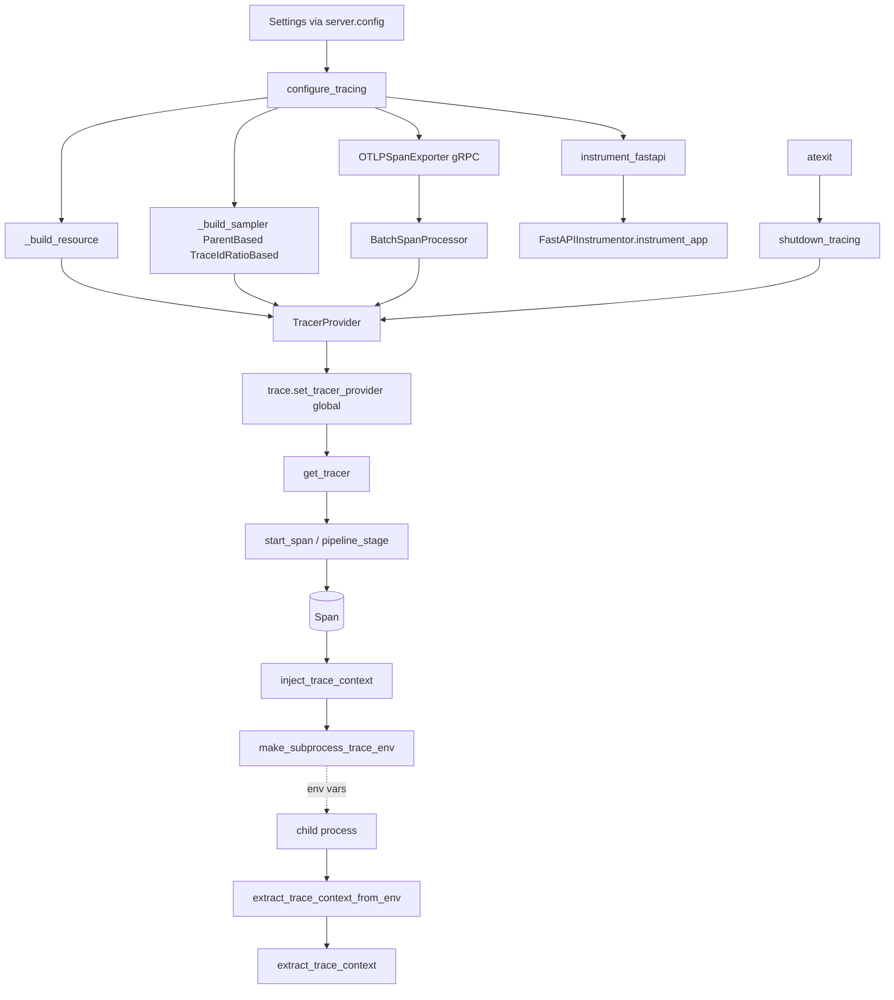

# server/logging/tracing.py

OpenTelemetry tracing bootstrap, FastAPI auto-instrumentation, and W3C trace-context propagation helpers (including cross-subprocess propagation via environment variables).

## Purpose and scope

`src/server/logging/tracing.py` centralizes distributed-tracing setup for the server. It configures a process-global `TracerProvider` with an OTLP/gRPC span exporter, instruments FastAPI, and exposes small helpers for creating spans, setting attributes/events, and propagating the active trace context across HTTP carriers and child subprocesses. Configuration is read from the application `Settings` object (`server.config`). Module-level flags make `configure_tracing` and `instrument_fastapi` idempotent so they can be called safely from both the API process and worker processes.

## Key entry points and contracts

- `TRACEPARENT_ENV_KEY` / `BAGGAGE_ENV_KEY` (constants): environment-variable names (`"YOURAPP_TRACEPARENT"`, `"YOURAPP_BAGGAGE"`) used to carry trace context to child processes.
- `configure_tracing(app=None, settings=None) -> None`: idempotently sets the global `TracerProvider` (resource, parent-based ratio sampler, `BatchSpanProcessor` over an `OTLPSpanExporter`) and registers it via `trace.set_tracer_provider`. If already configured and `app` is given, only instruments that app. `settings` defaults to `get_settings()`.
- `instrument_fastapi(app, settings=None) -> None`: applies `FastAPIInstrumentor.instrument_app` with `excluded_urls` derived from settings; no-op if already instrumented. `settings` defaults to `get_settings()`.
- `shutdown_tracing() -> None`: flushes and shuts down the global provider (if any) and resets the configured flag. Registered with `atexit` at import time.
- `get_tracer(name=None) -> Tracer`: returns a named tracer; `name` defaults to the configured `observability.service_name`.
- `start_span(name, *, tracer_name=None, kind=SpanKind.INTERNAL, attributes=None, context=None)` (context manager): starts and yields a `Span` as the current span, optionally applying `attributes` and an explicit parent `context`.
- `set_span_attributes(span, attributes) -> None`: sets each key/value of `attributes` on the given open `span`.
- `add_span_event(name, *, attributes=None) -> None`: adds a named event to the current span only when it `is_recording()`; otherwise silently does nothing.
- `inject_trace_context(carrier=None) -> dict[str, str]`: injects the current trace context and baggage (W3C `traceparent` / `baggage`) into a carrier dict and returns a copy. Defaults to an empty carrier.
- `extract_trace_context(carrier) -> Any`: extracts an OpenTelemetry `Context` from a W3C carrier mapping (trace context plus baggage). Accepts `None` (treated as empty).
- `make_subprocess_trace_env() -> dict[str, str]`: serializes the current trace context into `{TRACEPARENT_ENV_KEY, BAGGAGE_ENV_KEY}` env-var mappings (only keys that are present); returns `{}` when there is nothing to propagate.
- `extract_trace_context_from_env(env=None) -> Any | None`: rebuilds a trace context from the env vars produced by `make_subprocess_trace_env`; defaults to `os.environ` and returns `None` when neither key is set.
- `pipeline_stage(stage, *, attributes=None, context=None)` (context manager): opens a span named `pipeline.<stage>` with a `pipeline.stage` attribute (merged with any extra `attributes`) and yields the `Span`.

Private helpers (`_build_resource`, `_build_sampler`, `_excluded_urls`) are implementation details and not part of the public surface.

## Architecture / data flow



## Dependencies and side effects

- External libraries: `opentelemetry-api`/`opentelemetry-sdk` (trace API, `TracerProvider`, `BatchSpanProcessor`, `Resource`, samplers), `opentelemetry-exporter-otlp-proto-grpc` (`OTLPSpanExporter`), `opentelemetry-instrumentation-fastapi` (`FastAPIInstrumentor`), W3C trace-context / baggage propagators, and `fastapi`. Standard library: `atexit`, `os`, `re`, `contextlib`, `collections.abc`, `typing`.
- Internal: `server.config.Settings` / `get_settings()` for `observability` (service name, OTLP endpoint, sample ratio), `tracing` (insecure flag, timeout), `app.env`, `metrics.path`, and optional `fastapi` (docs/redoc/openapi URLs).
- Side effects: mutates process-global state via module-level flags (`_tracing_configured`, `_fastapi_instrumented`, `_tracer_provider`) and `trace.set_tracer_provider`; instruments the passed FastAPI app in place; opens a gRPC OTLP exporter connection and emits spans asynchronously via the batch processor; registers `shutdown_tracing` with `atexit` at import time. `inject_trace_context`/`extract_trace_context` import the trace-context propagator lazily inside the function bodies.

## Error handling behavior

The module performs no broad exception swallowing; it relies on idempotency guards and OpenTelemetry's own semantics:

- `configure_tracing` and `instrument_fastapi` short-circuit (return early) when already configured/instrumented, preventing duplicate providers or instrumentation.
- `add_span_event` guards on `span.is_recording()`, so events are dropped (no error) when there is no recording span.
- `shutdown_tracing` is null-safe (no-op when the provider was never created) and is invoked automatically at process exit.
- `make_subprocess_trace_env` and `extract_trace_context_from_env` tolerate missing context, returning `{}` / `None` respectively rather than raising.
- `extract_trace_context` and `inject_trace_context` accept `None` carriers (coerced to an empty dict).
- Exporter/connection failures surface through the OpenTelemetry exporter and batch processor, not through this module's API.

## Test coverage mapping and execution commands

There are currently no dedicated unit tests for this module under `tests/` (a search for tracing-named or tracing-referencing test files returned none). The repository quality gate requires 100% coverage of public functions; this module's public functions listed above are therefore not yet covered and should gain tests (suggested cases: idempotent re-configuration, `excluded_urls` assembly from settings, span attribute/event helpers with recording and non-recording spans, and the inject/extract/env round trip).

Run the project test suite (and coverage gate) with:

```bash
./scripts/test-suite.sh
```

## Known assumptions and limitations

- Process-global, single-configuration design: state lives in module-level globals, so there is effectively one tracer provider per process and re-`configure_tracing` calls are intentional no-ops (a second, differently configured provider cannot be installed without `shutdown_tracing`).
- Assumes an OTLP/gRPC collector is reachable at `observability.otlp_endpoint`; the `tracing.insecure` flag and millisecond `tracing.timeout_ms` settings must be present.
- Assumes `Settings` exposes `observability`, `tracing`, `app.env`, and `metrics.path`; the `fastapi` settings block is optional and accessed defensively for excluded-URL derivation.
- Subprocess propagation only carries `traceparent` and `baggage`; other carrier keys are not transferred, and propagation depends on the child invoking `extract_trace_context_from_env`.
- Sampling is head-based parent sampling using a fixed configured ratio; no tail or dynamic sampling.
- Environment-variable keys are template placeholders (`YOURAPP_*`) and should be renamed per deployment to avoid collisions.
