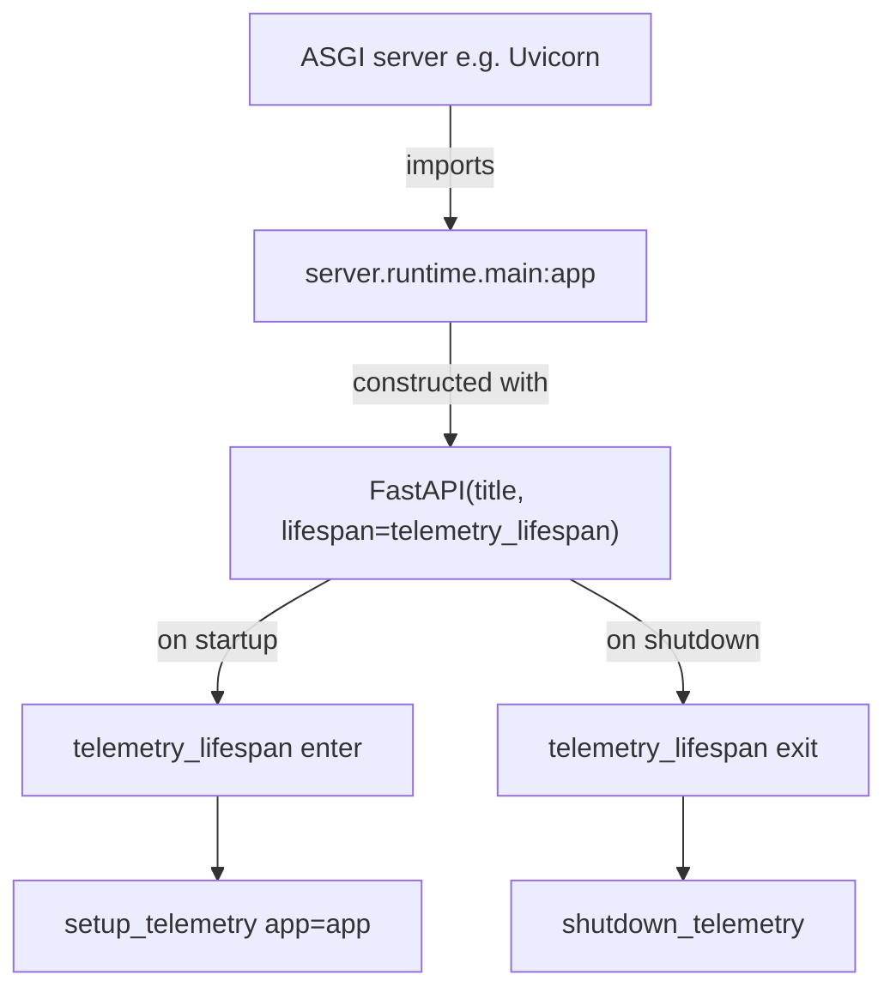

# server/runtime/main.py

FastAPI ASGI application factory module that constructs and exposes the process-wide `app` instance with telemetry wired into its lifespan.

## Purpose and scope

This module is the ASGI entrypoint for the server. It imports the telemetry lifespan handler and instantiates a single `FastAPI` application object named `app`, which ASGI servers (e.g. Uvicorn) import and serve. The module is intentionally minimal: it owns only application construction and the binding of telemetry to the app lifecycle. It does not register routes, middleware, or business logic.

## Key entry points and contracts

- **`app`** (module-level `fastapi.FastAPI` instance): The ASGI application served by the runtime. Constructed with `title="yourapp"` and `lifespan=telemetry_lifespan`, so process telemetry is initialized on startup and torn down on shutdown. This is the public symbol ASGI servers reference (e.g. `server.runtime.main:app`). Takes no arguments to construct (constructed at import time); raises nothing under normal import.

The module imports but does not redefine `telemetry_lifespan` from `server.logging.telemetry`. That async context manager calls `setup_telemetry(app=app)` before `yield` (startup) and `shutdown_telemetry()` after (shutdown).

## Architecture / data flow

## Dependencies and side effects

- **Imports**: `fastapi.FastAPI`; `telemetry_lifespan` from `server.logging.telemetry`.
- **Side effect at import time**: Instantiating `app` is the only side effect in this file. The heavier side effects (logging, metrics, tracing configuration; runtime directory creation) are deferred to the lifespan handler and therefore run on application startup, not at import. See `src/server/logging/telemetry.py` for those behaviors.

## Error handling behavior

This module contains no explicit error handling. Construction of the `FastAPI` instance does not raise under normal conditions. Any failures originating from telemetry setup occur inside the lifespan handler (`telemetry_lifespan` / `setup_telemetry`) during application startup, not within this module; those are handled (or surfaced) by `src/server/logging/telemetry.py` and the ASGI server.

## Test coverage mapping and execution commands

There are no dedicated unit tests for this module under `tests/`. The path string `src/server/runtime/main.py` appears in `tests/unit/test_check_memory_reasoning.py`, but only as fixture text, not as an import or exercise of `app`. The public surface here is the single `app` constant; its behavioral contract (telemetry on startup/shutdown) is owned and tested via `server.logging.telemetry`.

Run the full suite with `./scripts/test-suite.sh`.

## Known assumptions and limitations

- Assumes `server.logging.telemetry.telemetry_lifespan` is importable and is a valid FastAPI lifespan context manager.
- The application `title` is the placeholder `"yourapp"`; this is template scaffolding and should be renamed for a real project.
- No routes, middleware, exception handlers, or dependency overrides are registered here; the app is effectively empty apart from telemetry until other modules attach to it.
- A single module-level `app` is created at import; the module does not expose a factory function for building isolated app instances (e.g. for parametrized tests).
